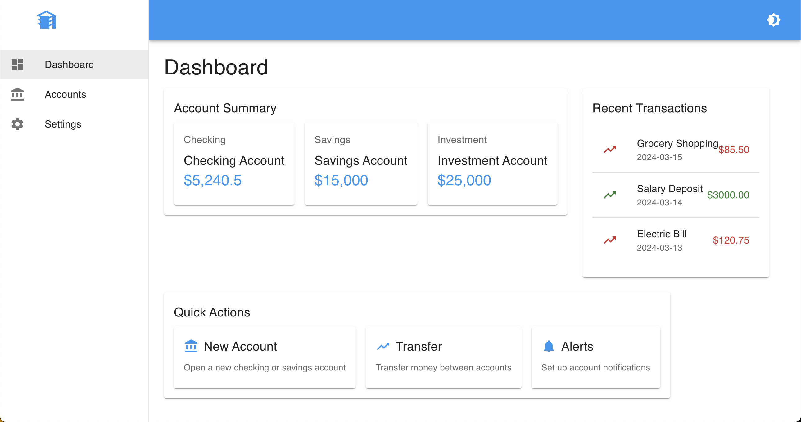

# LedgerLink 💰

A full-stack financial account management system that helps users and advisors manage users, accounts, transactions, and notifications. Built with ASP.NET Core and React, LedgerLink provides a secure and efficient way to handle financial data.

## ✨ Features

### 👥 User Management
- 🔐 Secure user authentication with JWT
- 📝 User registration and profile management
- 👮 Role-based access control (User/Admin)
- 🔒 Password hashing with BCrypt
- ✅ Account activation/deactivation

### 💳 Account Management
- 🏦 Multiple account types support
- 📊 Real-time balance tracking
- 📈 Account status monitoring
- 💱 Currency support
- 📜 Transaction history

### 💸 Transaction Management
- 🔄 Secure transaction processing
- 🔔 Transaction notifications
- 💰 Balance updates
- 📋 Transaction history tracking
- 📊 Transaction status monitoring

### 🔔 Notification System
- ⚡ Real-time transaction notifications
- 🚨 System alerts
- 📧 Email notifications (coming soon)
- ⚙️ Notification preferences
- 📌 Read/unread status tracking

## 🛠️ Tech Stack

### 🔙 Backend
- ⚡ ASP.NET Core 7.0 Web API
- 🗄️ Entity Framework Core with SQL Server
- 🔑 JWT Authentication
- 🧪 xUnit for testing
- 📚 Swagger/OpenAPI for API documentation
- 🔒 BCrypt for password hashing
- 🔄 AutoMapper for object mapping

### 🔜 Frontend
- ⚛️ React 18.x
- 🎨 Material-UI for components
- 🌐 Axios for HTTP requests
- 🛣️ React Router DOM for navigation
- 📦 Redux Toolkit for state management
- 🧪 Jest and React Testing Library for testing

## 📋 Prerequisites

- ⚡ .NET 7.0 SDK or later
- 🟢 Node.js 16.x or later
- 🗄️ SQL Server (LocalDB or remote instance)
- 📦 Git

## 🔧 Environment Setup

### 🔙 Backend Configuration
1. Create a `appsettings.Development.json` file in `backend/LedgerLink.API`:
```json
{
  "ConnectionStrings": {
    "DefaultConnection": "Server=(localdb)\\mssqllocaldb;Database=LedgerLinkDb;Trusted_Connection=True;MultipleActiveResultSets=true"
  },
  "Jwt": {
    "Key": "your-256-bit-secret-your-256-bit-secret-your-256-bit-secret-your-256-bit-secret",
    "Issuer": "ledgerlink",
    "Audience": "ledgerlink-users",
    "ExpirationInMinutes": 60
  }
}
```

### 🔜 Frontend Configuration
1. Create a `.env` file in the `frontend` directory:
```
REACT_APP_API_URL=http://localhost:5000
```

## 🚀 Getting Started

### 🔙 Backend Setup
1. Navigate to the backend directory:
   ```bash
   cd backend
   ```
2. Restore dependencies:
   ```bash
   dotnet restore
   ```
3. Apply database migrations:
   ```bash
   cd LedgerLink.API
   dotnet ef database update
   ```
4. Run the API:
   ```bash
   dotnet run
   ```
5. Access Swagger UI at: http://localhost:5000/swagger

### 🔜 Frontend Setup
1. Navigate to the frontend directory:
   ```bash
   cd frontend
   ```
2. Install dependencies:
   ```bash
   npm install
   ```
3. Start the development server:
   ```bash
   npm start
   ```
4. Access the application at: http://localhost:3000

## 📚 API Documentation

### 🔐 Authentication
- 🔑 POST /api/auth/login - User login
- ✍️ POST /api/auth/register - User registration

### 👥 Users
- 📋 GET /api/users - List all users (Admin only)
- 👤 GET /api/users/{id} - Get user by ID
- ➕ POST /api/users - Create new user
- ✏️ PUT /api/users/{id} - Update user
- 🗑️ DELETE /api/users/{id} - Delete user
- 🔑 PUT /api/users/change-password - Change password

### 💳 Accounts
- 📋 GET /api/accounts/{userId} - Get user accounts
- 👤 GET /api/accounts/{id} - Get account details
- ➕ POST /api/accounts - Create account
- ✏️ PUT /api/accounts/{id} - Update account
- 🗑️ DELETE /api/accounts/{id} - Delete account

### 💸 Transactions
- 📋 GET /api/transactions?accountId={id} - List transactions
- 👤 GET /api/transactions/{id} - Get transaction details
- ➕ POST /api/transactions - Create transaction
- ✏️ PUT /api/transactions/{id} - Update transaction
- 🗑️ DELETE /api/transactions/{id} - Delete transaction

### 🔔 Notifications
- 📋 GET /api/notifications?userId={id} - Get user notifications
- ✅ PUT /api/notifications/{id}/read - Mark notification as read
- 🗑️ DELETE /api/notifications/{id} - Delete notification

## 👨‍💻 Development

### 📝 Code Style
- 🔙 Backend follows C# coding conventions
- 🔜 Frontend uses ESLint and Prettier
- 📋 EditorConfig for consistent formatting

### 🧪 Testing
- 🔙 Backend: xUnit tests
- 🔜 Frontend: Jest and React Testing Library
- Run backend tests:
  ```bash
  cd backend
  dotnet test
  ```
- Run frontend tests:
  ```bash
  cd frontend
  npm test
  ```

### 🔒 Security Features
- 🔑 JWT-based authentication
- 🔒 Password hashing with BCrypt
- 👮 Role-based authorization
- 🔒 HTTPS enforcement
- 🛡️ SQL injection prevention
- 🛡️ XSS protection
- 🌐 CORS configuration

## 🚀 Deployment

### 🔙 Backend Deployment
1. Build the application:
   ```bash
   cd backend/LedgerLink.API
   dotnet publish -c Release
   ```
2. Deploy the published files to your hosting environment
3. Configure environment variables and connection strings
4. Run database migrations

### 🔜 Frontend Deployment
1. Build the application:
   ```bash
   cd frontend
   npm run build
   ```
2. Deploy the contents of the `build` folder to your hosting environment
3. Configure environment variables

## 🤝 Contributing

1. 🍴 Fork the repository
2. 🌿 Create a feature branch
3. 💾 Commit your changes
4. 📤 Push to the branch
5. 📬 Create a Pull Request

## 📄 License

MIT License - see the [LICENSE](LICENSE) file for details

## Dashboard Preview



